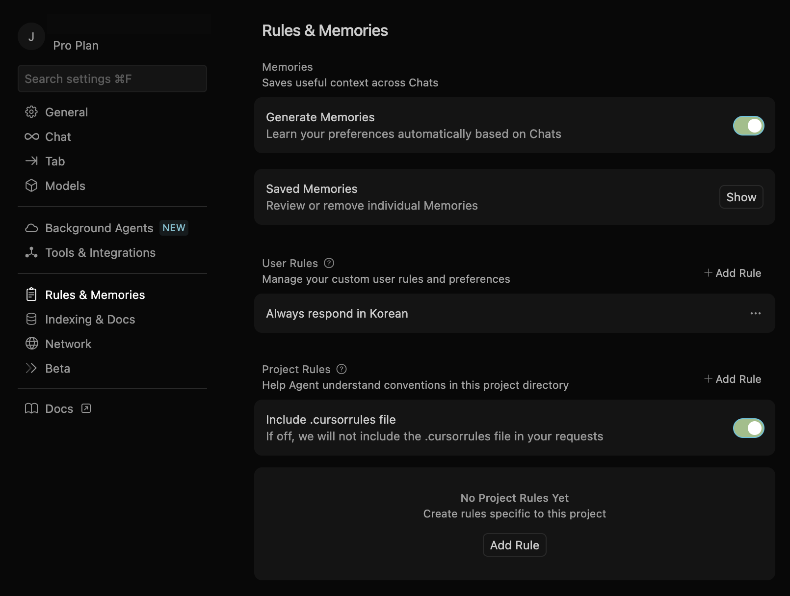

# cursorrules "v2"

이 리포지토리는 커서에 대한 사용자 지정 명령을 관리하기 위한 것입니다.

## 전제 

- 이 `v2`는 커서 에이전트 사용에 최적화되어 있습니다.
- Cursor Agent가 자주(인간의 개입을 받지 않고 자율 처리)를 할 수 있는 전제로서, Yolo 모드의 허가 커멘드를 적절하게 설정할 필요가 있습니다.
- 최신 업데이트 내용은 [업데이트 내역](CHANGELOG.md)을 참조하십시오.

## 개요 

- Cursor의 에이전트 기능이 릴리스되고 나서, 다양한 패턴의 처리를 통해서 느낀 것이 '분석력의 부족'이었습니다. 그 때문에, 모델(Claude 4/3.7 Sonnet)이 본래 가지고 있는 분석 능력을 끌어낼 수 있도록 궁리하기 시작한 것이, 나의 커스텀 인스트럭션 작성의 시작입니다.

- 다음으로 Cursor Agent가 사람의 개입을 받지 않고 자율처리할 수 있는 범위를 넓히는 것에 초점을 맞추어 상당한 효과를 얻을 수 있었습니다.

- 또한 '손 반환 방지'를 주제로 LLM에 의한 코딩에서 자주 발생하는 다음 문제를 해결했습니다. 
1. 모델 및 API 버전의 조상 반환 
1. 모듈 및 리소스 중복 생성 
1. 의도하지 않은 AI에 의한 디자인 변경 
1. 오류 처리의 무한 루프

- 커서 0.45 에서 커스텀 인스트럭션의 관리 방법이 `.cursorrules` 에서 Project Rules 로 변경되었습니다.

- 기술 스택, 디렉터리 구성은 사용자 지정 설치에서 다른 파일로 분리하고 @ 기호로 참조하는 별도의 파일로 정의됩니다. 프로젝트의 루트에 파일을 배치하고 @ 기호로 파일 참조를 다시 정의하십시오.

- 이 분리를 통해 기술 스택, 디렉토리 구성 등의 변경에 보다 유연하게 대응할 수 있게 되었습니다.

- `v2`의 작성 프로세스로서는, 초기에 Anthropic Prompt Generator로 작성한 것을, Claude 3.7 Sonnet나 ChatGPT(o1 pro)등을 사용해 조정해, Cursor로 실시 검증을 반복했습니다. 커스터마이즈시에도, AI에 의한 평가를 실시하는 것을 추천합니다.

- 한정된 환경과 시간으로의 검증을 위해, 용도나 환경에 의해 효과에 차이가 생길 가능성이 있습니다.

- 자세한 업데이트 내용은 [CHANGELOG.md](CHANGELOG.md)를 참조하십시오.

## 사용법

1. 커서 설정 화면의 Rules 탭에서 Project Rules 영역에서 Add new rule 버튼을 클릭합니다.
2. "global"이외의 해당 이름에 대한 규칙 이름을 지정하고 Enter합니다.
3. `.cursor/rules` 폴더가 만들어지기 때문에, 본 리포지토리의 「global.mdc」를 복사해, 거기에 저장합니다.
4. 2.에서 만든 파일을 삭제합니다.
5. `technologystack.md`, `directorystructure.md`를 프로젝트의 루트 디렉토리에 저장한다.

- Project Rules 에서는 파일이나 폴더의 패턴 매칭으로 적용하는 규칙을 전환하는 기능이 있습니다.
- @ 기호에 의한 파일 참조는 매우 편리합니다.
- 커스텀 인스트럭션은, 프롬프트에 있어서의 태스크 설계, 문맥(참조 자료 등)과의 조합으로 최대한의 효과를 발휘합니다.

## 주의사항

- Rules for AI에 불일치하는 지시, 대량의 기재가 있으면 효과가 감소합니다.

## 라이선스

MIT 라이센스하에 게시됩니다. 자세한 내용은 [LICENSE](LICENSE) 파일을 참조하십시오.

## 지원 

- 이 리포지토리에 대한 지원은 없지만 의견은 환영합니다.
[X（Twitter）](https://x.com/gaebalai)